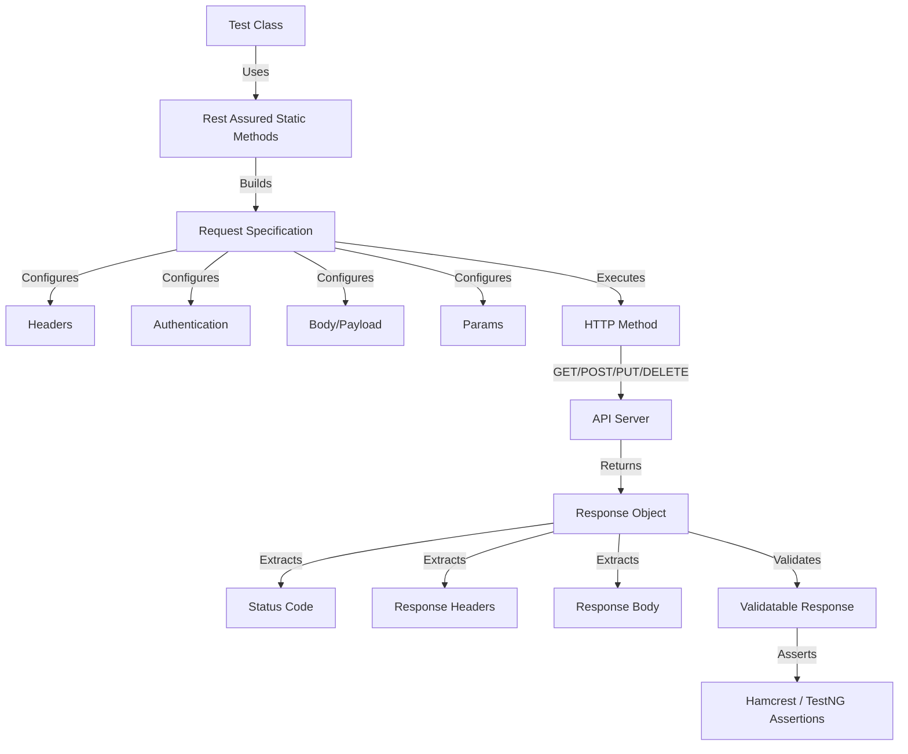
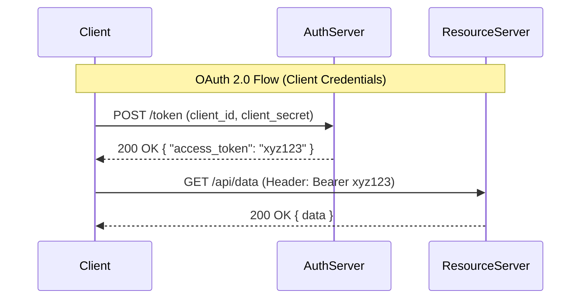
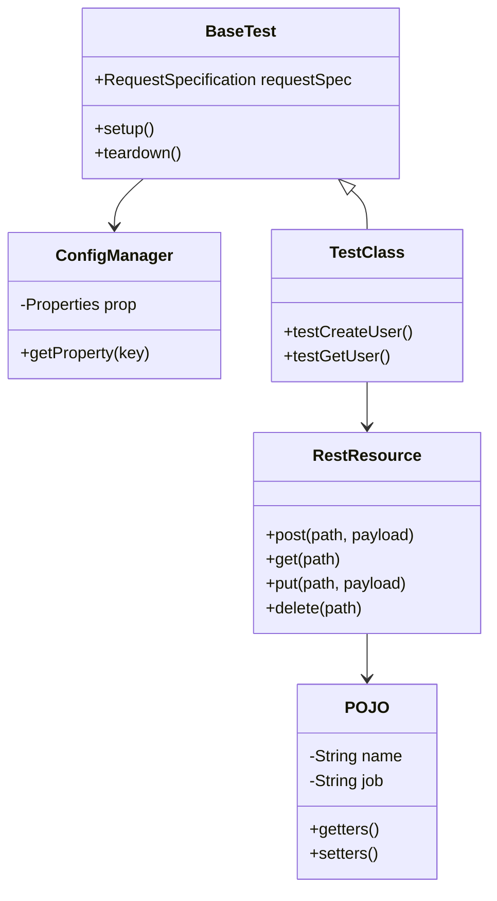

# Rest Assured Mindmaps

## 1. Rest Assured Architecture

```mermaid
graph TD
    User[Test Class] -->|Uses| RA[Rest Assured Static Methods]
    RA -->|Builds| Req[Request Specification]
    Req -->|Configures| H[Headers]
    Req -->|Configures| A[Authentication]
    Req -->|Configures| B[Body/Payload]
    Req -->|Configures| P[Params]
    
    Req -->|Executes| M[HTTP Method]
    M -->|GET/POST/PUT/DELETE| Server[API Server]
    
    Server -->|Returns| Resp[Response Object]
    
    Resp -->|Extracts| S[Status Code]
    Resp -->|Extracts| RH[Response Headers]
    Resp -->|Extracts| RB[Response Body]
    
    Resp -->|Validates| V[Validatable Response]
    V -->|Asserts| Assert[Hamcrest / TestNG Assertions]
```

## 2. Authentication Flows

```mermaid
sequenceDiagram
    participant Client
    participant AuthServer
    participant ResourceServer

    Note over Client, ResourceServer: OAuth 2.0 Flow (Client Credentials)
    Client->>AuthServer: POST /token (client_id, client_secret)
    AuthServer-->>Client: 200 OK { "access_token": "xyz123" }
    
    Client->>ResourceServer: GET /api/data (Header: Bearer xyz123)
    ResourceServer-->>Client: 200 OK { data }
```

## 3. Automation Framework Components

```mermaid
classDiagram
    class BaseTest {
        +setup()
        +teardown()
        +RequestSpecification requestSpec
    }
    
    class ConfigManager {
        -Properties prop
        +getProperty(key)
    }
    
    class RestResource {
        +post(path, payload)
        +get(path)
        +put(path, payload)
        +delete(path)
    }
    
    class TestClass {
        +testCreateUser()
        +testGetUser()
    }
    
    class POJO {
        -String name
        -String job
        +getters()
        +setters()
    }
    
    BaseTest <|-- TestClass
    TestClass --> RestResource
    RestResource --> POJO
    BaseTest --> ConfigManager
```
