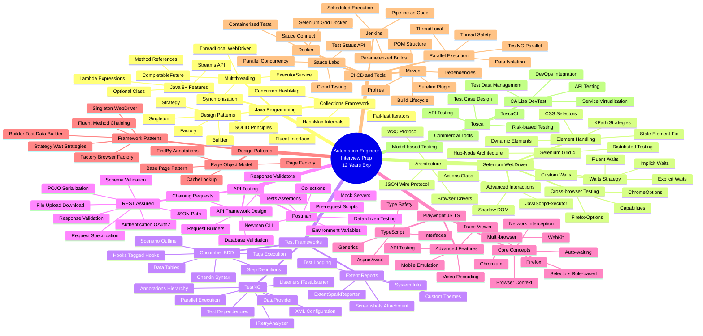

# Automation Engineer Interview Mind Map
## Visual Reference Guide for 12 Years Experience



---

## Quick Reference Cheat Sheet

### Week 1 Focus Areas
| Day | Primary Topic | Key Deliverable |
|-----|---------------|-----------------|
| 1-2 | Java Deep Dive | Thread-safe WebDriver Factory |
| 3-4 | Selenium Mastery | Custom Wait Framework |
| 5-6 | TestNG + Cucumber | Hybrid Framework Setup |
| 7 | Design Patterns | Complete POM Implementation |

### Week 2 Focus Areas
| Day | Primary Topic | Key Deliverable |
|-----|---------------|-----------------|
| 8-9 | API Testing | REST Assured Framework |
| 10 | Playwright | TypeScript POM |
| 11 | Tosca + CA Lisa | Tool Comparison Document |
| 12 | Maven + Parallel | Parallel Execution Setup |
| 13 | CI/CD | Jenkins Pipeline |
| 14 | Mock Interviews | Scenario Solutions |

---

## Critical Interview Topics - Priority Matrix

### 🔴 Must Know (Asked in 90% of interviews)
- Selenium WebDriver architecture and waits
- Page Object Model implementation
- TestNG annotations and parallel execution
- REST Assured API testing
- Maven project structure
- Exception handling in frameworks
- CI/CD integration basics

### 🟡 Should Know (Asked in 60% of interviews)
- Cucumber BDD framework
- Design patterns (Singleton, Factory, Builder)
- Extent Reports integration
- Selenium Grid architecture
- Thread safety in parallel execution
- Postman and Newman
- Docker containerization

### 🟢 Good to Know (Asked in 30% of interviews)
- Playwright vs Selenium comparison
- Advanced Java 8+ features
- Tosca and CA Lisa
- Sauce Labs cloud testing
- Advanced design patterns
- Service virtualization concepts

---

## Technology Stack Quick Reference

```
┌─────────────────────────────────────────────────────────────┐
│                    AUTOMATION TECH STACK                     │
├─────────────────────────────────────────────────────────────┤
│                                                              │
│  Programming:  Java 8+ (Streams, Lambda, Collections)       │
│                                                              │
│  UI Testing:   Selenium WebDriver 4.x                        │
│                Playwright (TypeScript/JavaScript)            │
│                                                              │
│  Frameworks:   TestNG (Parallel, Listeners, DataProvider)   │
│                Cucumber BDD (Gherkin, Hooks, Tags)           │
│                                                              │
│  API Testing:  REST Assured (POJO, Auth, Validation)        │
│                Postman + Newman                              │
│                                                              │
│  Design:       Page Object Model + Page Factory             │
│                Singleton, Factory, Builder, Strategy         │
│                                                              │
│  Build Tool:   Maven (Surefire, Profiles, Dependencies)     │
│                                                              │
│  Reporting:    Extent Reports (Screenshots, Logs)           │
│                                                              │
│  CI/CD:        Jenkins Pipeline, Docker, GitHub Actions     │
│                                                              │
│  Cloud:        Sauce Labs (Parallel, Sauce Connect)         │
│                                                              │
│  Commercial:   Tosca (Model-based), CA Lisa (DevTest)       │
│                                                              │
└─────────────────────────────────────────────────────────────┘
```

---

## Interview Question Categories

### 1️⃣ Technical Depth Questions
- Explain HashMap internals and use in test data management
- How does Selenium WebDriver communicate with browsers?
- Design a thread-safe WebDriver management system
- Implement custom wait conditions for complex scenarios

### 2️⃣ Framework Design Questions
- Design an automation framework from scratch
- How do you handle flaky tests?
- Implement retry mechanism for failed tests
- Create a scalable page object model

### 3️⃣ API Testing Questions
- Design end-to-end API test framework
- Handle OAuth 2.0 authentication flow
- Implement request/response chaining
- Validate API → Database → UI flow

### 4️⃣ Parallel Execution Questions
- Implement parallel test execution strategy
- Handle thread safety issues
- Manage WebDriver instances across threads
- Optimize execution time from 8 hours to 2 hours

### 5️⃣ CI/CD Integration Questions
- Create Jenkins pipeline for test execution
- Implement Docker-based test environment
- Schedule automated test runs
- Integrate with Sauce Labs for cloud testing

### 6️⃣ Scenario-Based Questions
- Production bug escaped automation - how to investigate?
- Application uses dynamic IDs - framework strategy?
- Lead team of 5 engineers - ensure code quality?
- Choose between Selenium and Playwright - decision criteria?

### 7️⃣ Leadership & Strategy Questions
- Mentor junior automation engineers
- Improve test coverage from 40% to 80%
- Justify ROI of automation investment
- Handle disagreements on automation approach

---

## Key Formulas to Remember

### Test Automation ROI
```
ROI = (Time Saved × Cost per Hour - Automation Cost) / Automation Cost × 100%
```

### Parallel Execution Time
```
Execution Time = Total Tests / (Threads × Tests per Thread) + Setup Overhead
```

### Test Coverage
```
Coverage = (Automated Scenarios / Total Scenarios) × 100%
```

### Defect Detection Efficiency
```
DDE = (Defects Found by Automation / Total Defects) × 100%
```

---

## Common Pitfalls to Avoid

> [!WARNING]
> **Senior-Level Interview Mistakes:**

❌ **Don't Say:**
- "I just use Thread.sleep() for waits"
- "I haven't used CI/CD integration"
- "I only know Selenium, not modern tools"
- "I don't know design patterns"
- "I've never done parallel execution"

✅ **Do Say:**
- "I use explicit waits with custom conditions"
- "I've integrated frameworks with Jenkins/Docker"
- "I've evaluated Playwright vs Selenium for our needs"
- "I implement Singleton pattern for WebDriver management"
- "I've optimized parallel execution with ThreadLocal"

---

## Daily Practice Checklist

### Morning Routine (Before Study)
- [ ] Review previous day's notes
- [ ] Solve 2 Java coding problems
- [ ] Read 1 automation blog/article

### During Study
- [ ] Take notes in own words
- [ ] Create code examples for each concept
- [ ] Draw diagrams for architecture topics
- [ ] Practice explaining concepts aloud

### Evening Routine (After Study)
- [ ] Summarize key learnings
- [ ] Identify gaps in understanding
- [ ] Prepare questions for next day
- [ ] Review interview questions

---

## Final Preparation Checklist

### Technical Preparation
- [ ] Build 1 complete hybrid framework (Selenium + TestNG + Cucumber)
- [ ] Create REST Assured API testing framework
- [ ] Implement parallel execution with thread safety
- [ ] Set up Jenkins pipeline with Docker
- [ ] Practice Playwright with TypeScript
- [ ] Review all design patterns with examples

### Interview Preparation
- [ ] Prepare 5 detailed project examples
- [ ] Practice 20+ scenario-based questions
- [ ] Review behavioral questions (STAR method)
- [ ] Prepare questions to ask interviewer
- [ ] Set up laptop with all tools for live coding
- [ ] Practice whiteboard coding

### Day Before Interview
- [ ] Review framework architecture diagrams
- [ ] Go through common interview questions
- [ ] Test all tools on laptop
- [ ] Prepare professional setup for virtual interview
- [ ] Get good sleep (8 hours)

---

## Resources Quick Links

### Practice Platforms
- **Java**: LeetCode, HackerRank, CodeWars
- **Selenium**: Selenium.dev, ToolsQA, Guru99
- **API Testing**: RESTful-booker API, JSONPlaceholder
- **Playwright**: playwright.dev official docs

### GitHub Repositories to Study
- Search: "selenium framework java testng"
- Search: "rest assured framework"
- Search: "playwright typescript framework"
- Search: "cucumber bdd framework"

### YouTube Channels
- Automation Step by Step
- SDET QA Automation
- Testing Mini Bytes
- Naveen AutomationLabs

---

## Success Metrics

### By End of Week 1
✅ Built complete Selenium framework with POM  
✅ Implemented TestNG + Cucumber integration  
✅ Created custom wait utilities  
✅ Practiced 50+ Java interview questions  

### By End of Week 2
✅ Built REST Assured API framework  
✅ Implemented parallel execution  
✅ Created Jenkins CI/CD pipeline  
✅ Practiced 30+ scenario-based questions  
✅ Completed 5+ mock interviews  

---

## Remember: STAR Method for Behavioral Questions

**S**ituation - Set the context  
**T**ask - Describe your responsibility  
**A**ction - Explain what you did  
**R**esult - Share the outcome  

### Example:
**Q: Tell me about a challenging automation project**

**S**: Our regression suite took 12 hours to run  
**T**: I was tasked to reduce execution time to under 3 hours  
**A**: Implemented parallel execution with Selenium Grid, optimized test data setup, removed redundant tests  
**R**: Reduced execution time to 2.5 hours, increased test coverage by 30%, saved 200 hours/month  

---

## Good Luck! 🎯

**Remember**: At 12 years experience, interviewers expect:
- 🏗️ **Architecture** - Not just coding, but designing scalable solutions
- 🧠 **Problem-solving** - Handling complex real-world scenarios
- 👥 **Leadership** - Mentoring teams and driving best practices
- 💼 **Business value** - Linking automation to ROI and quality metrics
- 🚀 **Innovation** - Staying current with modern tools and practices

**You've got this!** Your experience is your strength - showcase it with confidence! 💪
