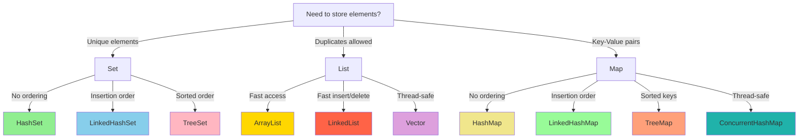
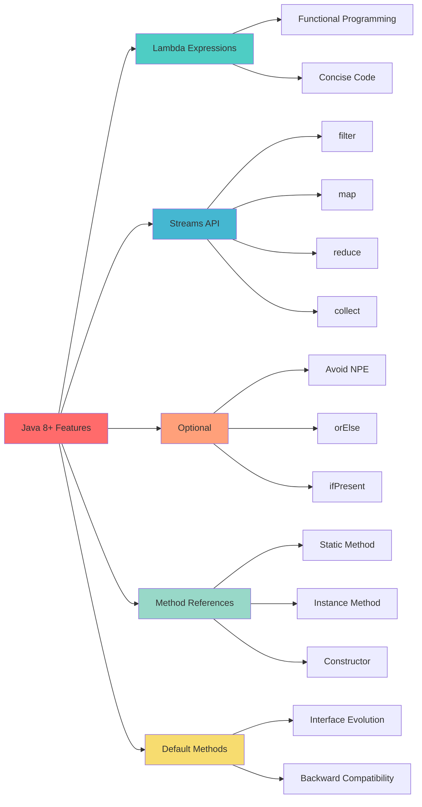
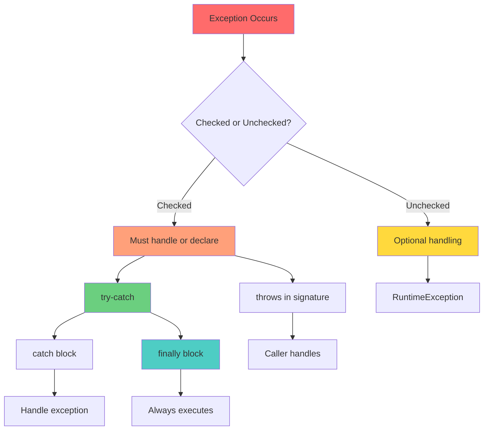
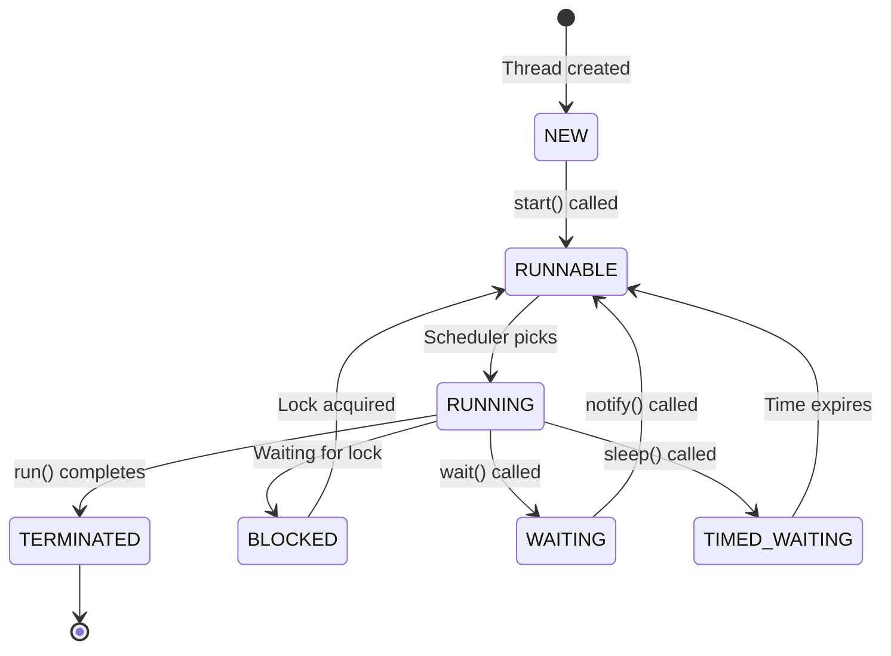
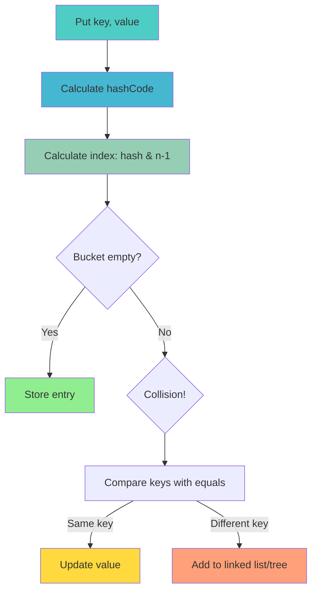
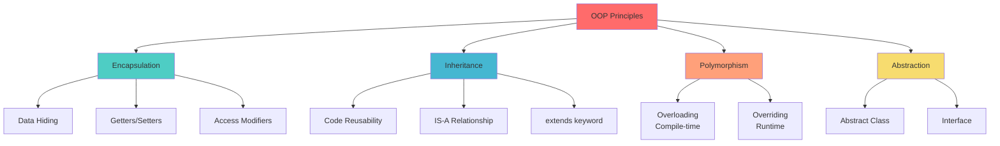
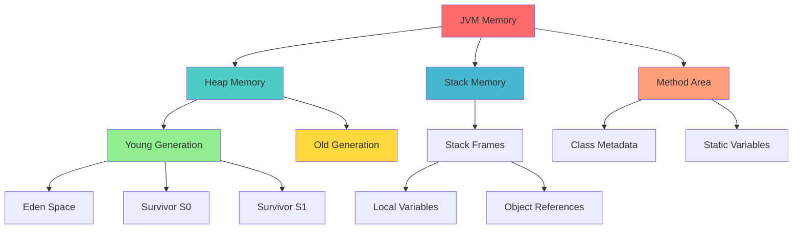
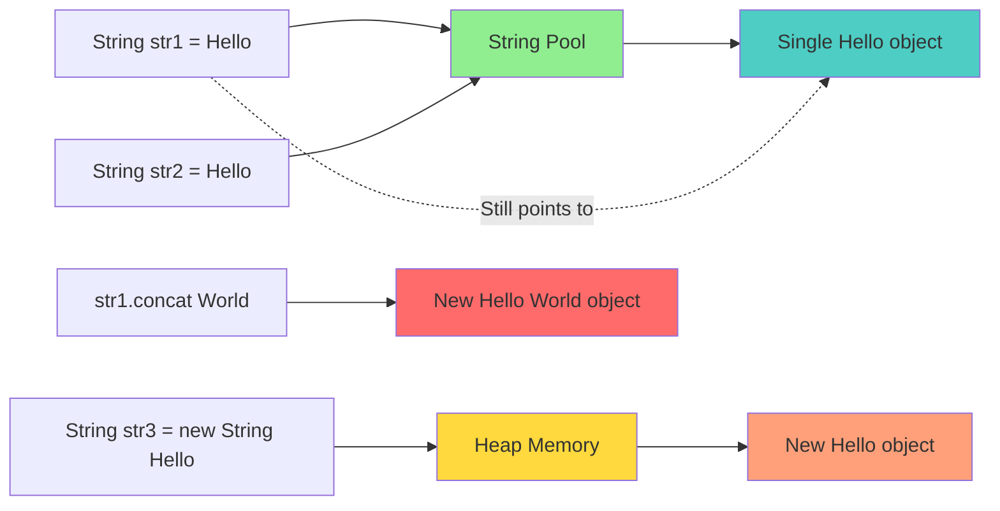

# Java Core Concepts - Visual Mind Map
## Quick Reference for Interview Preparation

> [!TIP]
> Use this visual mind map to quickly recall Java concepts during interview preparation. Each section is color-coded and organized hierarchically for easy memory recall.

---

## Complete Java Mind Map

```mermaid
mindmap
  root((Java Core
    Concepts))
    Java Basics
      Data Types
        Primitive Types
          byte short int long
          float double
          char boolean
        Reference Types
          Classes
          Interfaces
          Arrays
        Wrapper Classes
          Integer Double
          Character Boolean
          Autoboxing Unboxing
      Access Modifiers
        public
        protected
        default package private
        private
      Keywords
        static Shared across instances
        final Constant immutable
        this Current object
        super Parent class
      Type Casting
        Widening Implicit
        Narrowing Explicit
    
    OOP Principles
      Encapsulation
        Data Hiding
        Private Variables
        Public Getters Setters
        Controlled Access
      Inheritance
        extends keyword
        super constructor
        IS-A Relationship
        Code Reusability
        Single Inheritance
        Multilevel Inheritance
        Hierarchical Inheritance
      Polymorphism
        Method Overloading
          Compile-time
          Same name different params
          Return type can vary
        Method Overriding
          Runtime
          Same signature
          @Override annotation
          Dynamic binding
      Abstraction
        Abstract Class
          abstract methods
          Concrete methods
          Constructor allowed
          Instance variables
        Interface
          All methods abstract
          public static final
          Multiple inheritance
          default methods Java 8
          static methods Java 8
    
    Collections Framework
      List Interface
        ArrayList
          Dynamic array
          Fast random access
          Slow insertion deletion
          Not synchronized
          Initial capacity 16
        LinkedList
          Doubly linked list
          Fast insertion deletion
          Slow random access
          Implements Deque
        Vector
          Synchronized ArrayList
          Legacy class
          Stack extends Vector
      Set Interface
        HashSet
          No duplicates
          Backed by HashMap
          No ordering
          One null allowed
        LinkedHashSet
          Insertion order
          Doubly linked list
        TreeSet
          Sorted order
          Red-Black tree
          No null values
          NavigableSet
      Map Interface
        HashMap
          Key-value pairs
          One null key
          Multiple null values
          Not synchronized
          O 1 access
          Load factor 0.75
          Initial capacity 16
        LinkedHashMap
          Insertion order
          Access order option
        TreeMap
          Sorted by keys
          Red-Black tree
          No null keys
        Hashtable
          Synchronized
          Legacy
          No null key value
        ConcurrentHashMap
          Thread-safe
          Segment locking
          No null key value
          Better than Hashtable
      Queue Interface
        PriorityQueue
          Heap based
          Natural ordering
        ArrayDeque
          Resizable array
          No null elements
    
    String Handling
      String Class
        Immutable
        String Pool
        Thread-safe
        Final class
      String Methods
        length charAt
        substring
        toUpperCase toLowerCase
        trim strip
        contains startsWith endsWith
        indexOf lastIndexOf
        replace replaceAll
        split join
        equals compareTo
      StringBuilder
        Mutable
        Not thread-safe
        Fast performance
        append insert delete
        reverse
      StringBuffer
        Mutable
        Thread-safe
        Synchronized
        Slower than StringBuilder
      Comparison
        == Reference equality
        equals Content equality
        compareTo Lexicographic
    
    Exception Handling
      Exception Hierarchy
        Throwable
          Error
            OutOfMemoryError
            StackOverflowError
          Exception
            Checked Exceptions
              IOException
              SQLException
              ClassNotFoundException
            Unchecked RuntimeException
              NullPointerException
              ArrayIndexOutOfBoundsException
              ArithmeticException
              IllegalArgumentException
      Try-Catch-Finally
        try block
        catch Multiple catches
        finally Always executes
        try-with-resources
      Throw vs Throws
        throw Explicit exception
        throws Method signature
      Custom Exceptions
        Extend Exception
        Extend RuntimeException
        Constructor with message
    
    Multithreading
      Thread Creation
        Extend Thread class
        Implement Runnable
        Lambda expression
        Callable Future
      Thread Lifecycle
        NEW
        RUNNABLE
        RUNNING
        BLOCKED
        WAITING TIMED_WAITING
        TERMINATED
      Synchronization
        synchronized method
        synchronized block
        Static synchronization
        Prevents race condition
      ThreadLocal
        Thread-local variables
        Each thread own copy
        WebDriver management
        set get remove
      ExecutorService
        newFixedThreadPool
        newCachedThreadPool
        newSingleThreadExecutor
        newScheduledThreadPool
        submit shutdown
      CompletableFuture
        Asynchronous computation
        supplyAsync
        thenApply thenAccept
        thenCombine
        exceptionally
    
    Java 8 Plus Features
      Lambda Expressions
        Anonymous functions
        Functional programming
        Syntax params arrow body
        Shorter code
      Functional Interfaces
        Single abstract method
        @FunctionalInterface
        Predicate test
        Function apply
        Consumer accept
        Supplier get
        BiFunction
      Streams API
        filter
        map
        reduce
        collect
        forEach
        sorted
        distinct
        limit skip
        anyMatch allMatch noneMatch
        findFirst findAny
        Collectors
          toList toSet toMap
          groupingBy
          partitioningBy
          joining
      Optional
        Avoid NullPointerException
        of ofNullable empty
        isPresent ifPresent
        orElse orElseGet
        orElseThrow
        map filter
      Method References
        Static ClassName staticMethod
        Instance object instanceMethod
        Arbitrary ClassName instanceMethod
        Constructor ClassName new
      Default Methods
        Interface default methods
        Backward compatibility
        Multiple inheritance
      Date Time API
        LocalDate
        LocalTime
        LocalDateTime
        ZonedDateTime
        Period Duration
        DateTimeFormatter
    
    Memory Management
      Memory Areas
        Heap
          Young Generation
            Eden Space
            Survivor S0 S1
          Old Generation Tenured
        Stack
          Method calls
          Local variables
          References
        Method Area
          Class metadata
          Static variables
        PC Registers
        Native Method Stack
      Garbage Collection
        Automatic memory management
        Unreferenced objects
        System.gc
        finalize deprecated
        Eligibility
          Nullifying reference
          Reassigning reference
          Out of scope
      Memory Leaks
        Unclosed resources
        Static collections
        Listeners not removed
        ThreadLocal not cleaned
```



---

## Quick Comparison Tables

### Collections Comparison



---

## Java 8 Features Flow



---

## Exception Handling Flow



---

## Thread Lifecycle Diagram



---

## HashMap Internal Working



---

## OOP Principles Visual



---

## Memory Management Visual



---

## String Immutability Concept



---

## Quick Reference Cheat Sheet

### ArrayList vs LinkedList
| Feature | ArrayList | LinkedList |
|---------|-----------|------------|
| Structure | Dynamic array | Doubly linked list |
| Access | O(1) | O(n) |
| Insert/Delete | O(n) | O(1) |
| Memory | Less overhead | More (node pointers) |
| Use when | Frequent access | Frequent add/remove |

### HashMap vs ConcurrentHashMap vs Hashtable
| Feature | HashMap | ConcurrentHashMap | Hashtable |
|---------|---------|-------------------|-----------|
| Thread-safe | ❌ | ✅ | ✅ |
| Null key/value | ✅ | ❌ | ❌ |
| Performance | Fast | Good | Slow |
| Locking | None | Segment-level | Method-level |

### String vs StringBuilder vs StringBuffer
| Feature | String | StringBuilder | StringBuffer |
|---------|--------|---------------|--------------|
| Mutability | Immutable | Mutable | Mutable |
| Thread-safe | ✅ | ❌ | ✅ |
| Performance | Slow (concat) | Fast | Moderate |
| Use when | Fixed text | Single-thread | Multi-thread |

### Checked vs Unchecked Exceptions
| Checked | Unchecked |
|---------|-----------|
| Compile-time | Runtime |
| Must handle/declare | Optional |
| Extends Exception | Extends RuntimeException |
| IOException, SQLException | NullPointerException, ArithmeticException |

### Method Overloading vs Overriding
| Overloading | Overriding |
|-------------|------------|
| Compile-time polymorphism | Runtime polymorphism |
| Same class | Different classes (inheritance) |
| Different parameters | Same signature |
| Return type can vary | Return type same/covariant |

---

## Interview Memory Tricks

### Remember Collections Hierarchy
**"List Set Queue Map"** - Main interfaces

**ArrayList LinkedList Vector** - List implementations  
**HashSet LinkedHashSet TreeSet** - Set implementations  
**HashMap LinkedHashMap TreeMap** - Map implementations

### Remember OOP Principles
**"APIE"** - Abstraction, Polymorphism, Inheritance, Encapsulation

### Remember Java 8 Features
**"LOSMD"** - Lambda, Optional, Streams, Method references, Default methods

### Remember Access Modifiers (Most to Least restrictive)
**"PPPP"** - Private, Package (default), Protected, Public

### Remember Thread States
**"NEW RUN BLOCK WAIT TERM"** - NEW, RUNNABLE, BLOCKED, WAITING, TERMINATED

---

## Code Pattern Templates

### Singleton Pattern (Thread-safe)
```java
public class Singleton {
    private static volatile Singleton instance;
    private Singleton() {}
    
    public static Singleton getInstance() {
        if (instance == null) {
            synchronized (Singleton.class) {
                if (instance == null) {
                    instance = new Singleton();
                }
            }
        }
        return instance;
    }
}
```

### Immutable Class
```java
public final class Immutable {
    private final String name;
    private final List<String> items;
    
    public Immutable(String name, List<String> items) {
        this.name = name;
        this.items = new ArrayList<>(items); // Defensive copy
    }
    
    public String getName() { return name; }
    public List<String> getItems() {
        return new ArrayList<>(items); // Return copy
    }
}
```

### ThreadLocal for WebDriver
```java
public class DriverManager {
    private static ThreadLocal<WebDriver> driver = new ThreadLocal<>();
    
    public static void setDriver(WebDriver d) {
        driver.set(d);
    }
    
    public static WebDriver getDriver() {
        return driver.get();
    }
    
    public static void quitDriver() {
        if (driver.get() != null) {
            driver.get().quit();
            driver.remove();
        }
    }
}
```

---

## Top 10 Most Asked Interview Questions

1. **Explain HashMap internal working**
   - Hash calculation → Index calculation → Bucket storage → Collision handling

2. **Why is String immutable?**
   - Security, Thread-safety, Caching (String pool), HashCode caching

3. **ArrayList vs LinkedList - when to use which?**
   - ArrayList: Frequent access, LinkedList: Frequent insertion/deletion

4. **Difference between == and equals()?**
   - ==: Reference comparison, equals(): Content comparison

5. **What is ThreadLocal and its use in Selenium?**
   - Thread-local variables, WebDriver management in parallel execution

6. **Explain Java 8 Stream API with example**
   - filter, map, reduce, collect operations on collections

7. **Abstract class vs Interface?**
   - Abstract: Partial implementation, Interface: Contract only (before Java 8)

8. **How does garbage collection work?**
   - Automatic memory management, unreferenced objects reclaimed

9. **Checked vs Unchecked exceptions?**
   - Checked: Compile-time, must handle, Unchecked: Runtime, optional

10. **What is polymorphism? Types?**
    - Compile-time (overloading), Runtime (overriding)

---

> [!IMPORTANT]
> **Study Strategy:**
> 1. Review this mind map daily
> 2. Practice code examples from the main guide
> 3. Explain concepts aloud without looking
> 4. Draw diagrams on whiteboard
> 5. Connect concepts to your automation framework

**Master these visuals and you'll ace the Java interview!** 🎯
