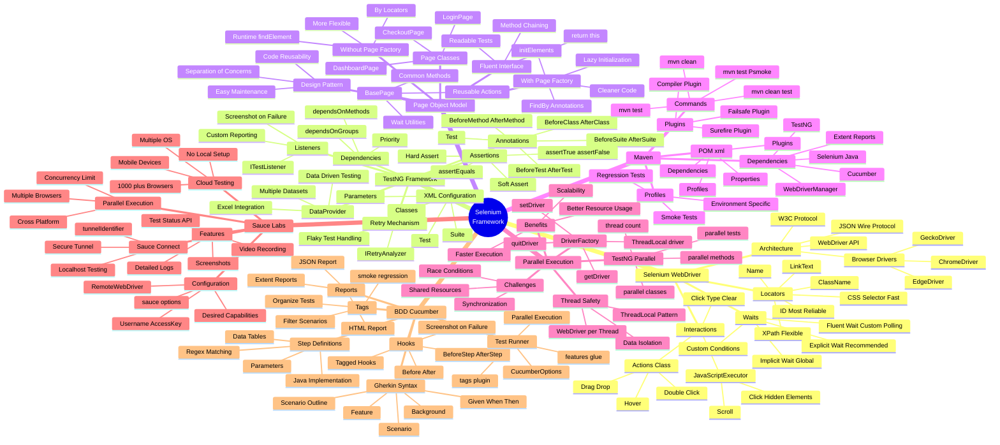
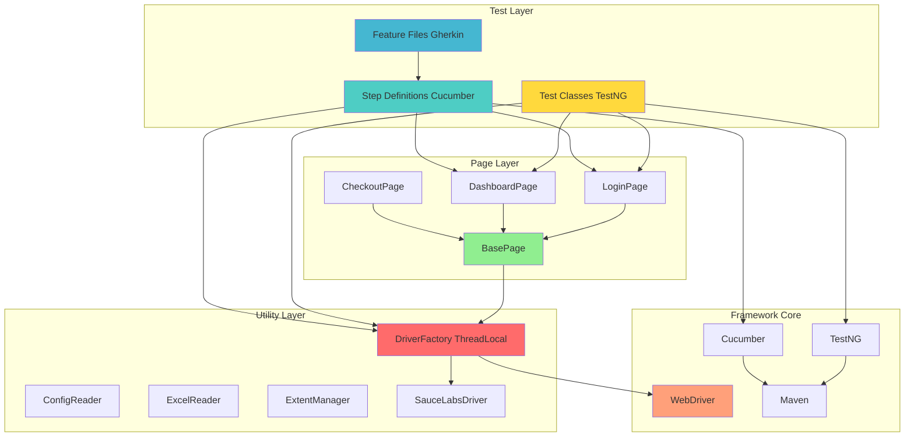
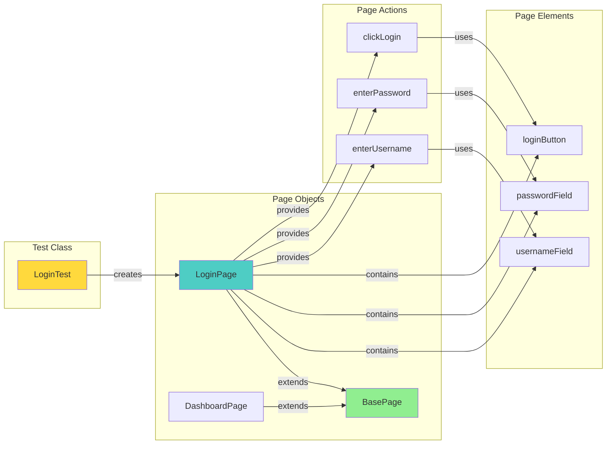
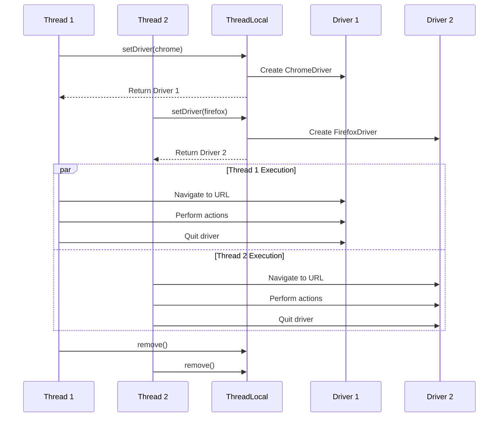
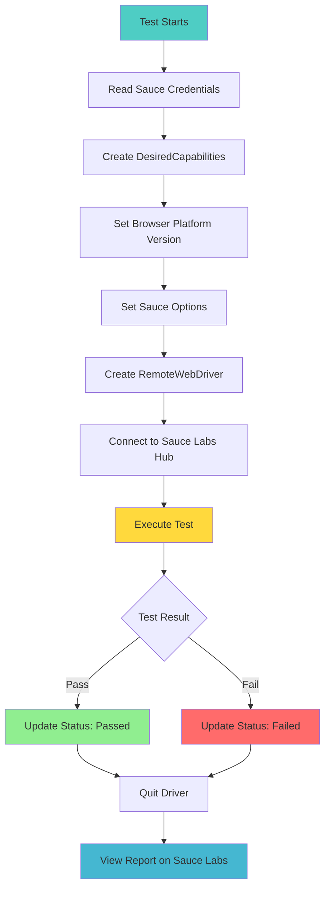
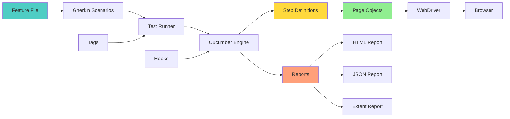

# Selenium Framework - Visual Mind Map
## Complete Framework Visualization for Interview Preparation

> [!TIP]
> Use this visual mind map alongside the detailed theory guide for comprehensive understanding. Each diagram represents a key concept in the Selenium automation framework.

---

## Complete Selenium Framework Mind Map



---

## Framework Architecture Diagram



---

## TestNG Annotations Execution Flow

```mermaid
graph TD
    A[@BeforeSuite] --> B[@BeforeTest]
    B --> C[@BeforeClass]
    C --> D[@BeforeMethod]
    D --> E[@Test Method 1]
    E --> F[@AfterMethod]
    F --> G{More Tests?}
    G -->|Yes| D
    G -->|No| H[@AfterClass]
    H --> I{More Tests?}
    I -->|Yes| C
    I -->|No| J[@AfterTest]
    J --> K{More Tests?}
    K -->|Yes| B
    K -->|No| L[@AfterSuite]
    
    style A fill:#FF6B6B
    style E fill:#90EE90
    style L fill:#4ECDC4
```

---

## Page Object Model Structure



---

## ThreadLocal Parallel Execution Flow



---

## Sauce Labs Integration Flow



---

## Cucumber BDD Workflow



---

## Comparison Tables

### Locator Strategy Comparison

| Locator | Speed | Reliability | Flexibility | Use Case |
|---------|-------|-------------|-------------|----------|
| ID | ⚡⚡⚡ | ⭐⭐⭐ | ⭐ | Unique IDs |
| Name | ⚡⚡⚡ | ⭐⭐ | ⭐ | Form fields |
| CSS | ⚡⚡⚡ | ⭐⭐ | ⭐⭐⭐ | Fast, powerful |
| XPath | ⚡⚡ | ⭐⭐ | ⭐⭐⭐ | Complex traversal |
| LinkText | ⚡⚡ | ⭐⭐ | ⭐ | Links only |

### Wait Strategy Comparison

| Wait Type | Scope | Flexibility | Performance | Best For |
|-----------|-------|-------------|-------------|----------|
| Implicit | Global | ❌ Low | ❌ Slow | Never use |
| Explicit | Element-specific | ✅ High | ✅ Fast | Recommended |
| Fluent | Element-specific | ✅ Very High | ✅ Fast | Custom conditions |

### POM vs Page Factory

| Feature | Page Object Model | Page Factory |
|---------|-------------------|--------------|
| Locator Definition | `By locator = By.id("...")` | `@FindBy(id="...")` |
| Element Finding | Runtime | Lazy initialization |
| Flexibility | ✅ High | ❌ Limited |
| Code Readability | ⭐⭐ | ⭐⭐⭐ |
| Dynamic Elements | ✅ Better | ❌ Challenging |
| Maintenance | ⭐⭐ | ⭐⭐⭐ |

### TestNG Parallel Modes

| Mode | Execution Level | Use Case | Thread Safety |
|------|----------------|----------|---------------|
| `parallel="tests"` | Test tags | Cross-browser | Required |
| `parallel="classes"` | Test classes | Different features | Required |
| `parallel="methods"` | Test methods | Maximum parallelism | Critical |
| `parallel="instances"` | Test instances | Data-driven | Required |

---

## Code Templates Quick Reference

### 1. ThreadLocal Driver Manager
```java
public class DriverFactory {
    private static ThreadLocal<WebDriver> driver = new ThreadLocal<>();
    
    public static void setDriver(String browser) {
        driver.set(new ChromeDriver());
    }
    
    public static WebDriver getDriver() {
        return driver.get();
    }
    
    public static void quitDriver() {
        driver.get().quit();
        driver.remove();
    }
}
```

### 2. Page Object with Page Factory
```java
public class LoginPage extends BasePage {
    @FindBy(id = "username")
    private WebElement usernameField;
    
    public LoginPage(WebDriver driver) {
        super(driver);
        PageFactory.initElements(driver, this);
    }
    
    public LoginPage enterUsername(String username) {
        type(usernameField, username);
        return this;
    }
}
```

### 3. Cucumber Step Definition
```java
@When("I enter username {string}")
public void i_enter_username(String username) {
    loginPage.enterUsername(username);
}
```

### 4. TestNG Listener
```java
public class TestListener implements ITestListener {
    @Override
    public void onTestFailure(ITestResult result) {
        takeScreenshot(result.getName());
    }
}
```

### 5. Sauce Labs Capabilities
```java
DesiredCapabilities caps = new DesiredCapabilities();
caps.setCapability("browserName", "chrome");
caps.setCapability("platformName", "Windows 10");

Map<String, Object> sauceOptions = new HashMap<>();
sauceOptions.put("username", SAUCE_USERNAME);
sauceOptions.put("accessKey", SAUCE_ACCESS_KEY);
caps.setCapability("sauce:options", sauceOptions);

WebDriver driver = new RemoteWebDriver(new URL(SAUCE_URL), caps);
```

---

## Top 20 Interview Questions

### Selenium WebDriver
1. **Explain Selenium WebDriver architecture**
   - WebDriver API → JSON Wire/W3C Protocol → Browser Driver → Browser

2. **Difference between findElement and findElements?**
   - findElement: Returns single WebElement, throws exception if not found
   - findElements: Returns List<WebElement>, returns empty list if not found

3. **When to use XPath vs CSS Selector?**
   - CSS: Faster, simpler syntax for direct relationships
   - XPath: More powerful, can traverse up (parent), text-based selection

4. **Explain different types of waits**
   - Implicit: Global, not recommended
   - Explicit: Element-specific, recommended
   - Fluent: Custom polling, most flexible

5. **How to handle StaleElementReferenceException?**
   - Re-locate element, use explicit waits, avoid storing WebElement references

### TestNG
6. **Explain TestNG annotations hierarchy**
   - BeforeSuite → BeforeTest → BeforeClass → BeforeMethod → Test → AfterMethod → AfterClass → AfterTest → AfterSuite

7. **Difference between hard assert and soft assert?**
   - Hard: Stops execution on failure
   - Soft: Continues execution, reports all failures at end

8. **How to run failed test cases again?**
   - Use IRetryAnalyzer interface, implement retry logic

9. **Explain dependsOnMethods vs priority**
   - dependsOnMethods: Execution order based on dependency
   - priority: Execution order by number (lower first)

10. **How to pass parameters in TestNG?**
    - testng.xml parameters, @Parameters annotation, @DataProvider

### Page Object Model
11. **Benefits of Page Object Model?**
    - Code reusability, easy maintenance, separation of concerns, reduced duplication

12. **Page Object Model vs Page Factory?**
    - POM: By locators, runtime finding, more flexible
    - Page Factory: @FindBy, lazy initialization, cleaner code

13. **What is fluent interface in POM?**
    - Method chaining using `return this`, improves readability

14. **How to handle dynamic elements in POM?**
    - Parameterized locators, dynamic XPath, explicit waits

15. **Explain BasePage concept**
    - Common methods (click, type, wait), inherited by all page classes

### Parallel Execution
16. **How to achieve thread safety in parallel execution?**
    - ThreadLocal pattern for WebDriver, data isolation, no shared state

17. **Explain ThreadLocal pattern**
    - Each thread gets its own copy of variable, prevents race conditions

18. **Different parallel modes in TestNG?**
    - tests, classes, methods, instances - each with different granularity

19. **Challenges in parallel execution?**
    - Thread safety, data isolation, synchronization, resource management

20. **How to optimize parallel execution time?**
    - Proper thread count, independent tests, cloud execution, resource pooling

---

## Framework Best Practices

> [!IMPORTANT]
> **Key Principles for Senior-Level Interviews:**

### 1. Design Principles
- ✅ Single Responsibility: Each class has one purpose
- ✅ DRY (Don't Repeat Yourself): Reusable components
- ✅ KISS (Keep It Simple): Avoid over-engineering
- ✅ Separation of Concerns: Tests, pages, utilities separate

### 2. Coding Standards
- ✅ Meaningful names for classes, methods, variables
- ✅ Comments for complex logic only
- ✅ Consistent formatting and structure
- ✅ Exception handling with proper logging

### 3. Test Design
- ✅ Independent tests (no dependencies between tests)
- ✅ Atomic tests (one scenario per test)
- ✅ Data-driven approach for multiple datasets
- ✅ Proper assertions with meaningful messages

### 4. Maintenance
- ✅ Version control (Git)
- ✅ Code reviews
- ✅ Regular refactoring
- ✅ Documentation (README, Javadoc)

### 5. Execution
- ✅ Parallel execution for faster feedback
- ✅ CI/CD integration (Jenkins, GitHub Actions)
- ✅ Cloud execution (Sauce Labs, BrowserStack)
- ✅ Comprehensive reporting (Extent, Allure)

---

## Memory Tricks

### Remember Locator Priority
**"I Need CSS X-rays Like Crazy"**
- **I**D, **N**ame, **CSS**, **X**Path, **L**inkText, **C**lassName

### Remember TestNG Annotations
**"Before Suite, Test, Class, Method - Test - After reverse"**

### Remember Wait Types
**"I Explicitly Fluently wait"**
- **I**mplicit, **E**xplicit, **F**luent

### Remember POM Benefits
**"CREM"**
- **C**ode reusability, **R**eadability, **E**asy maintenance, **M**odularity

### Remember Parallel Modes
**"Test Class Method Instance"**
- Tests, Classes, Methods, Instances

---

## Study Strategy

> [!TIP]
> **How to Master This Framework:**

1. **Week 1**: Selenium WebDriver + TestNG
   - Practice locators, waits, interactions
   - Build simple TestNG tests
   - Implement assertions and data providers

2. **Week 2**: Page Object Model
   - Create page classes for sample application
   - Implement both POM and Page Factory
   - Build BasePage with utilities

3. **Week 3**: Maven + Parallel Execution
   - Setup pom.xml with dependencies
   - Implement ThreadLocal pattern
   - Configure parallel execution

4. **Week 4**: Sauce Labs + Cucumber
   - Integrate Sauce Labs
   - Write feature files
   - Create step definitions

5. **Week 5**: Complete Framework + Practice
   - Build end-to-end framework
   - Practice interview questions
   - Mock interviews

---

**Master this framework and you'll excel in any Selenium automation interview!** 🚀
