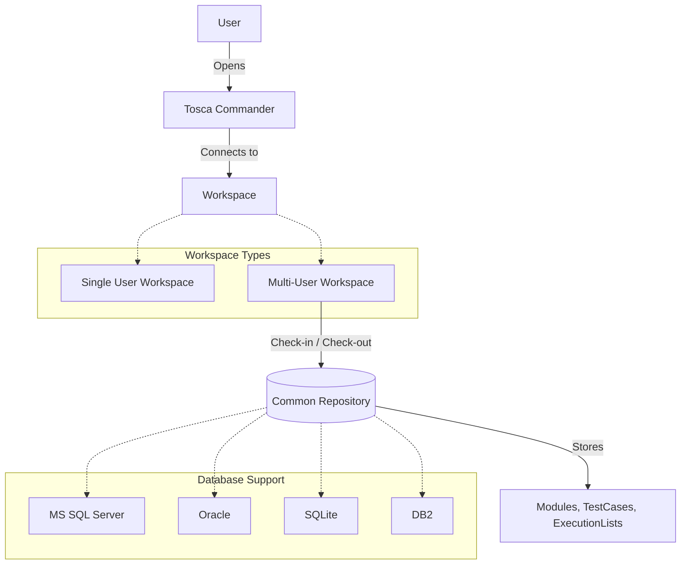
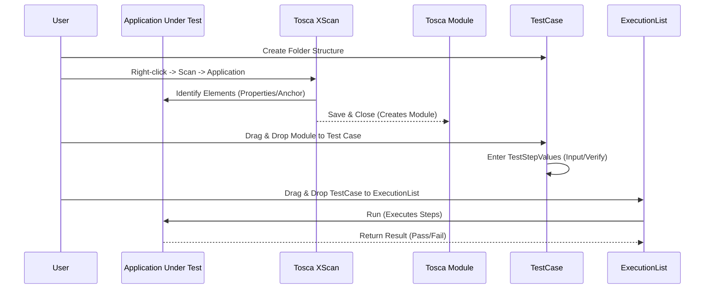
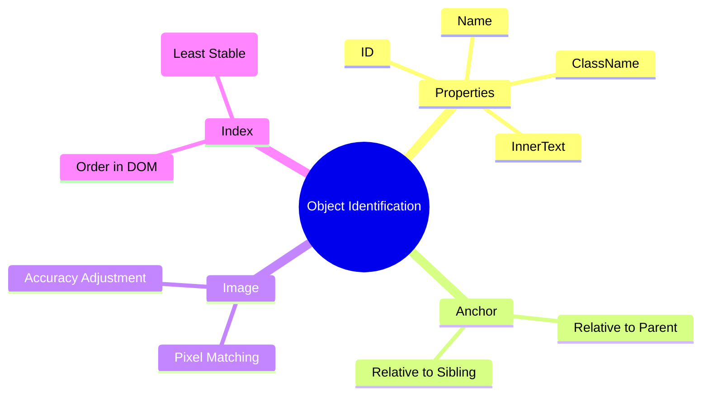

# Tricentis Tosca - Visual Mindmaps

This document contains visual representations of Tosca Architecture, Workflows, and key concepts using Mermaid diagrams.

## 1. Tosca Architecture & Workspaces



## 2. UI Automation Workflow



## 3. API Testing Workflow

```mermaid
flowchart LR
    Start([Start]) --> APIScan[Open API Scan]
    APIScan -->|Import| Def[Definition (URL/File)]
    Def --> Config[Configure Request]
    Config -->|Method, Auth, Payload| Send[Send Request]
    Send --> Verify{Verify Response?}
    Verify -- No --> Config
    Verify -- Yes --> Export[Export to Tosca]
    Export --> TC[Tosca Commander]
    
    subgraph "Tosca Commander"
        TC -->|Creates| APIMod[API Module]
        TC -->|Creates| APITC[API TestCase]
    end
    
    APITC -->|Add| Verifications[Verify Status/Body]
    APITC -->|Run| Exec[Execution]
```

## 4. Distributed Execution (DEX) Flow

```mermaid
graph TD
    Tester[Tester/CI] -->|Triggers Execution| TC[Tosca Commander / CI Client]
    TC -->|Sends ExecutionList| DS[Distribution Server]
    
    subgraph "Distribution Agents (DEX Agents)"
        A1[Agent 1 (Chrome)]
        A2[Agent 2 (Firefox)]
        A3[Agent 3 (API)]
    end
    
    DS -->|Distributes Tests| A1
    DS -->|Distributes Tests| A2
    DS -->|Distributes Tests| A3
    
    A1 -->|Updates Result| CR[(Common Repository)]
    A2 -->|Updates Result| CR
    A3 -->|Updates Result| CR
    
    CR -->|Syncs| TC
    TC -->|Shows| Results[Pass/Fail Report]
```

## 5. Identifying Objects Strategy


